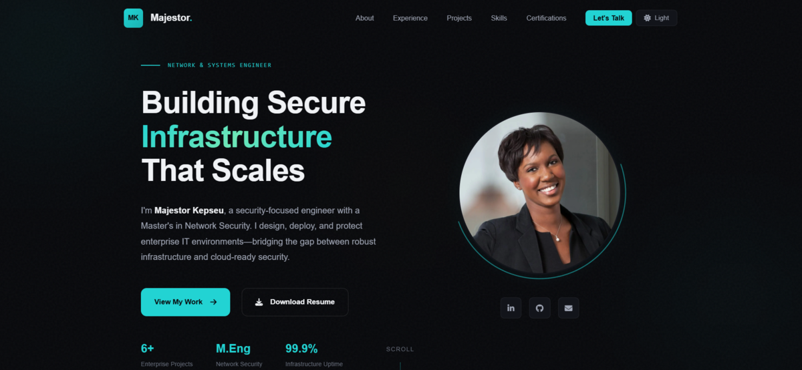

# Majestor Kepseu - Portfolio

A premium, responsive portfolio website showcasing enterprise infrastructure and network engineering projects. Built with vanilla HTML, CSS, and JavaScript with a focus on elegant design, accessibility, and performance.



---

## Live Demo

[View Portfolio](https://perrinio-dev.github.io/my-portfolio/)

---

## Features

### Design
- **Premium Dark/Light Theme** - Dual-theme system with OS auto-detection, manual toggle, and cross-page persistence via `localStorage`
- **Atmospheric Backgrounds** - Subtle gradient orbs with depth and noise overlay
- **Distinctive Typography** - Sora (display) + DM Sans (body) + JetBrains Mono (code) font pairing
- **Minimal Animations** - Scroll-triggered reveal animations using `IntersectionObserver`
- **Fully Responsive** - Optimized for desktop, tablet, and mobile with dedicated breakpoints at 1024px, 768px, and 480px

### Content
- **Hero Section** - Professional introduction with stats, portrait, and call-to-action
- **About** - Background story with career motivation cards
- **Experience** - CAMTEL internship with achievement metrics
- **Projects** - 4 comprehensive enterprise projects with dedicated case study pages
- **Skills** - Organized by domain (Identity, Virtualization, Networking, Security, etc.)
- **Education** - Vertical timeline showing academic progression
- **Certifications** - Roadmap with status indicators (Completed, In Progress, Planned, Later)
- **Contact** - Form with Formspree integration + direct contact info

### Technical
- **Semantic HTML5** - Accessible, SEO-friendly markup with ARIA labels
- **Centralized Design Tokens** - Shared `variables.css` used by both main and project stylesheets
- **Vanilla JavaScript** - No framework dependencies, fast load times
- **FOUC Prevention** - Blocking theme script in `<head>` ensures correct theme before first paint
- **Smooth Scrolling** - Scroll with nav offset compensation using `replaceState` (no history pollution)
- **Image Lightbox** - Gallery with keyboard navigation (Escape, Arrow keys) and mobile swipe gestures
- **Mobile Menu** - Slide-in navigation with backdrop overlay and click-outside dismiss
- **Reduced Motion** - Respects `prefers-reduced-motion` across all animations

---

## Project Structure

```
my-portfolio/
├── index.html                # Main portfolio page
├── variables.css             # Shared design tokens (single source of truth)
├── style.css                 # Main page styles (imports variables.css)
├── project-styles.css        # Project page styles (imports variables.css)
├── script.js                 # Theme, navigation, animations, contact form
├── lightbox.js               # Shared lightbox with keyboard nav + swipe gestures
├── favicon.ico               # Favicon (ICO)
├── .nojekyll                 # GitHub Pages bypass for Jekyll processing
├── README.md
│
├── assets/
│   ├── profile.jpg           # Professional headshot
│   ├── preview.png           # Portfolio preview screenshot
│   ├── favicon.svg           # Favicon (SVG)
│   ├── favicon.png           # Favicon (PNG fallback)
│   ├── Majestor_Kepseu_Resume.pdf  # Downloadable resume
│   └── projects/             # Project screenshots and diagrams
│       ├── capstone/
│       ├── vsphere/
│       ├── exchange/
│       └── network/
│
└── projects/
    ├── capstone-platform.html       # Unified Collaboration Platform
    ├── virtualization-cluster.html  # VMware vSphere Infrastructure
    ├── exchange-server-dag.html     # Exchange Server 2019 with DAG
    └── multi-site-network.html      # Multi-Site Enterprise Network
```

---

## Architecture Decisions

| Decision | Approach | Rationale |
|----------|----------|-----------|
| Design tokens | `variables.css` imported by both stylesheets | Single source of truth; change once, apply everywhere |
| Theme persistence | Blocking `<script>` in `<head>` on every page | Prevents flash of wrong theme (FOUC) on navigation |
| Lightbox | Shared `lightbox.js` with touch support | One file to maintain; swipe gestures for mobile UX |
| Mobile menu | Backdrop overlay + click-outside dismiss | Standard modal pattern; consistent with user expectations |
| Animations | `IntersectionObserver` with `unobserve` | Performant; each element animates once, then stops observing |
| History | `replaceState` for section links | Avoids polluting browser back/forward history |

---

## Setup & Deployment

### Prerequisites
- A web browser (Chrome, Firefox, Safari, Edge)
- A web server or hosting platform (GitHub Pages, Netlify, Vercel, etc.)

### Local Development

1. **Clone the repository**
   ```bash
   git clone https://github.com/PERRINIO-dev/my-portfolio.git
   cd my-portfolio
   ```

2. **Serve locally** (choose one method)
   ```bash
   # Using Python
   python -m http.server 8000

   # Using Node.js
   npx serve

   # Using VS Code
   # Install "Live Server" extension and click "Go Live"
   ```

3. **Open in browser**
   ```
   http://localhost:8000
   ```

### Deployment

#### GitHub Pages
1. Push code to a GitHub repository
2. Go to Settings > Pages
3. Select branch (`main`) and folder (root)
4. Your site will be live at `https://username.github.io/repository`

#### Netlify
1. Connect your GitHub repository
2. Build command: *(leave empty)*
3. Publish directory: `.`
4. Deploy

#### Custom Domain
Add a `CNAME` file with your domain name, then configure DNS settings with your registrar.

---

## Customization

### Colors & Theming
Edit design tokens in `variables.css`:

```css
:root {
    --bg-deep: #0a0c14;
    --bg-primary: #10131c;
    --accent: #c49070;
    --accent-dim: #a87c5e;
    /* ... */
}

[data-theme="light"] {
    --bg-deep: #f2f4f7;
    --bg-primary: #f9fafb;
    --accent: #7a5636;
    /* ... */
}
```

Both `style.css` and `project-styles.css` import this file, so changes apply globally.

### Typography
Update font variables in `variables.css` and the corresponding Google Fonts `<link>` in each HTML file's `<head>`.

### Content
- **Personal Info** - Edit `index.html` directly
- **Projects** - Modify files in `projects/`
- **Contact Form** - Replace Formspree endpoint in `index.html`

---

## Adding Project Images

### Architecture Diagrams
```html
<div class="architecture-image" data-lightbox="architecture" data-caption="Your Caption">
    
</div>
```

### Gallery Images
```html
<div class="gallery-item" data-lightbox="gallery" data-caption="Screenshot Description">
    
    <span class="gallery-caption">Label</span>
</div>
```

### Recommended Image Sizes
| Type | Dimensions | Format |
|------|------------|--------|
| Profile Photo | 400x400px | JPG/WebP |
| Architecture Diagram | 1200x800px | PNG |
| Gallery Screenshots | Keep native resolution | PNG/WebP |
| Preview/OG Image | 1200x630px | PNG |

---

## Contact Form Setup

The contact form uses [Formspree](https://formspree.io/) for backend processing.

1. Create a free account at formspree.io
2. Create a new form and copy the endpoint
3. Update the form action in `index.html`:

```html
<form id="contact-form" action="https://formspree.io/f/YOUR_FORM_ID" method="POST">
```

---

## Browser Support

| Browser | Version |
|---------|---------|
| Chrome | 90+ |
| Firefox | 88+ |
| Safari | 14+ |
| Edge | 90+ |

---

## Featured Projects

### 1. Unified Collaboration & Management Platform
**Type:** Enterprise IT Integration | **Team:** 5 members

Capstone project delivering AD-integrated platform with Zimbra, Zabbix, Zammad, Headwind MDM, Docker gateway, and enterprise PKI.

### 2. VMware vSphere Enterprise Infrastructure
**Type:** Virtualization | **Individual Project**

Production-grade virtualized datacenter with nested ESXi hosts, vCenter, DRS automation, HA failover, and Fault Tolerance.

### 3. Exchange Server 2019 with DAG
**Type:** Messaging & Collaboration | **Individual Project**

Highly available enterprise messaging with Database Availability Group, automated failover, and full AD integration.

### 4. Multi-Site Enterprise Network
**Type:** Core Networking & Security | **Team:** 4 members

Secure network connecting Toronto, Vancouver, and Tokyo with EIGRP routing, VLANs, ACLs, and centralized management.

---

## License

This portfolio is personal work. Feel free to use it as inspiration, but please don't copy content directly.

---

## Author

**Majestor Kepseu**

- Network & Infrastructure Engineer
- Cloud Security Engineer
- M.Eng Network Security | Post-Graduate Certificate, Applied Network Infrastructure

Location: Kitchener, Ontario, Canada

[](https://linkedin.com/in/majestor-kepseu)
[](https://github.com/PERRINIO-dev)
[](mailto:majestork@gmail.com)

---

<p align="center">
  <sub>Built with precision and passion. &copy; 2026 Majestor Kepseu</sub>
</p>
